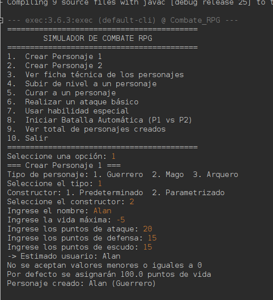
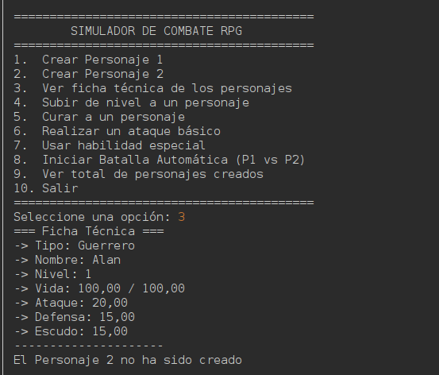
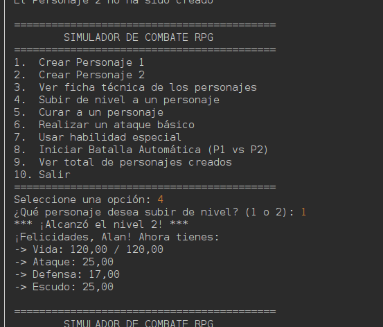
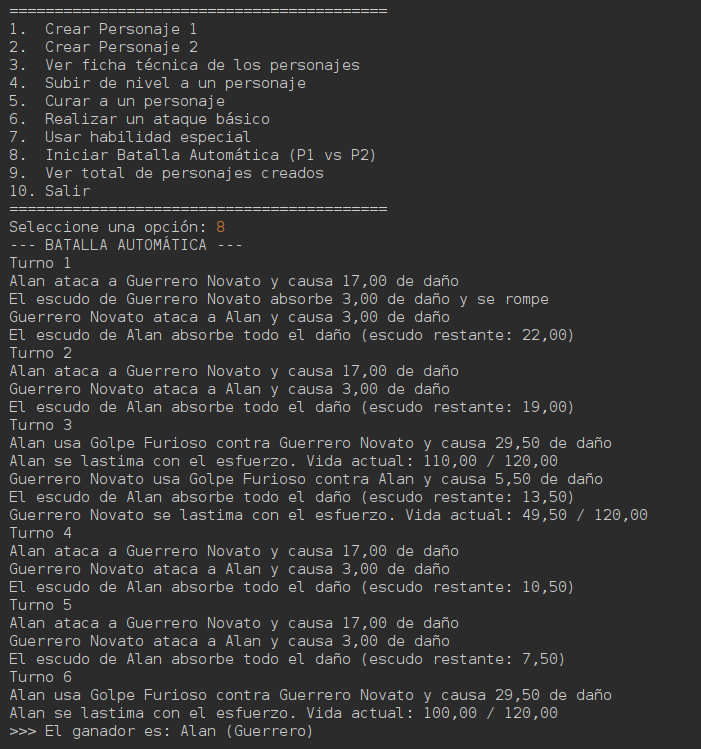

# ⚔️ Simulador de Combate RPG en Java

Simulador de combate por turnos que se ejecuta en consola. El usuario crea dos personajes, consulta sus estadísticas, los cura, los sube de nivel y los enfrenta en ataques individuales o en una batalla automática, todo desde un menú interactivo.

El proyecto fue desarrollado como taller práctico de **Programación Orientada a Objetos**, aplicando clases, objetos, atributos, métodos, constructores y miembros estáticos, sin utilizar arreglos, listas, herencia ni polimorfismo.

> La versión 2.0 incorpora herencia, interfaces y polimorfismo. Consulta la sección [Actualizaciones](#-actualizaciones) para ver los cambios.

---

## 📁 Estructura del proyecto

```
com.alangomez.combate_rpg
├── Main.java                 → Punto de entrada con el menú interactivo
└── classes
    ├── Personaje.java        → Representa a un personaje y sus acciones
    └── Batalla.java          → Métodos estáticos de utilidad para el combate
```

Las clases del modelo se agruparon en el package `classes` para separar la lógica del juego del programa principal.

---

## 🧩 Descripción de las clases

### `Personaje.java`

Representa a un combatiente con sus estadísticas y las acciones que puede realizar.

**Atributos de instancia:** `nombre`, `puntosVida`, `puntosVidaMax`, `puntosAtaque`, `puntosDefensa` y `nivel`.

**Atributos estáticos:**

| Atributo | Función |
|---|---|
| `totalPersonajesCreados` | Cuenta todos los personajes creados en el sistema. |
| `totalPersonajesPredeterminados` | Numera los personajes sin nombre ("Guerrero Novato", "Guerrero Novato 2", ...). |

**Constructores:**

| Constructor | Comportamiento |
|---|---|
| `Personaje()` | Crea un "Guerrero Novato" con 100 de vida, 15 de ataque, 5 de defensa y nivel 1. |
| `Personaje(nombre, vidaMax, ataque, defensa)` | Crea un personaje con los valores del usuario, validando cada uno. |

**Métodos:**

| Método | Descripción |
|---|---|
| `atacar(Personaje objetivo)` | Calcula `ataque − defensa del objetivo`. Si el resultado es 0 o menor, aplica un daño mínimo de 3.0. |
| `recibirDano(double cantidad)` | Resta vida; si baja de 0, la ajusta a 0.0. |
| `curar()` | Recupera 25 puntos de vida sin superar la vida máxima e informa cuánto se recuperó realmente. |
| `estaVivo()` | Devuelve `true` si la vida es mayor que 0. |
| `subirNivel()` | Sube 1 nivel, +20 vida máxima, +5 ataque, +2 defensa y restaura la vida completa. |
| `mostrarEstado()` | Imprime la ficha técnica del personaje. |
| `getTotalPersonajesCreados()` | Método estático que devuelve el total de personajes creados. |

### `Batalla.java`

Clase de utilidad con métodos **estáticos**, por lo que se usa sin crear objetos (`Batalla.iniciarPeleaAutomatica(p1, p2)`).

| Método | Descripción |
|---|---|
| `ejecutarAtaqueCritico(atacante, objetivo, multiplicador)` | Multiplica el ataque y usa casting `(int)` para redondear el daño hacia abajo. Ejemplo: 15 × 1.5 = 22.5 → 22. |
| `iniciarPeleaAutomatica(p1, p2)` | Ciclo `while` que alterna ataques por rondas mientras ambos estén vivos y al final anuncia al ganador. |

### `Main.java`

Contiene el menú interactivo dentro de un ciclo `do-while`, controlado con `Scanner` y un `switch`. Los personajes se guardan en dos variables de referencia (`p1` y `p2`) inicializadas en `null`.

---

## 🎮 Menú del programa

```
==========================================
        SIMULADOR DE COMBATE RPG
==========================================
1. Crear Personaje 1 (Constructor Predeterminado)
2. Crear Personaje 2 (Constructor Parametrizado)
3. Ver ficha técnica de los personajes
4. Subir de nivel a un personaje
5. Curar a un personaje
6. Realizar un ataque individual
7. Iniciar Batalla Automática (P1 vs P2)
8. Ver total de personajes creados en el sistema
9. Salir
==========================================
Seleccione una opción:
```

---

## 🛠️ Conceptos aplicados

**Clases y objetos.** `Personaje` funciona como plantilla y cada `new Personaje()` crea un objeto independiente con sus propios valores.

**Encapsulamiento.** Todos los atributos son `private` y se accede a ellos mediante *getters* y *setters*. Los setters validan que no se asignen valores menores o iguales a 0.

**Constructores.** Se implementaron dos: uno predeterminado y uno parametrizado, cada uno con su propia forma de inicializar el objeto.

**La palabra `this`.** Se usa para diferenciar los atributos del objeto de los parámetros con el mismo nombre (`this.puntosAtaque = puntosAtaque`).

**Objetos como parámetros.** `atacar(Personaje objetivo)` recibe el objeto completo, lo que permite leer su defensa y modificar su vida.

**Miembros estáticos.** Los contadores pertenecen a la clase y no a cada objeto, por eso se comparten entre todos los personajes. `Batalla` usa métodos estáticos porque no necesita guardar estado propio.

**Casting explícito.** `(int) (ataque * multiplicador)` convierte el resultado a entero después de multiplicar.

**Operador ternario.** Se usa para decisiones cortas, como elegir el ganador o generar el número del nombre por defecto.

**Estructuras de control.** `do-while` para el menú, `while` para la batalla automática, `switch` para las opciones e `if/else` para las validaciones.

---

## ✅ Validaciones implementadas

**Nombre vacío o nulo.** Si el usuario no escribe un nombre (o solo escribe espacios), se asigna automáticamente "Guerrero Novato" con un número consecutivo.

**Valores inválidos.** Si la vida, el ataque o la defensa son menores o iguales a 0, se muestra un aviso y se asigna el valor por defecto (100.0, 15.0 y 5.0). Cada valor se valida de forma independiente.

**Límites de vida.** La vida nunca baja de 0 al recibir daño ni supera el máximo al curarse.

**Personajes no creados.** Antes de usar `p1` o `p2`, el menú verifica que no sean `null` para evitar errores (`NullPointerException`).

**Personajes derrotados.** Un personaje sin vida no puede atacar ni ser atacado, y la batalla automática solo inicia si ambos están vivos.

---

## 🖨️ Formato de las salidas

Las salidas en consola se formatearon con `System.out.printf` para que la información sea clara y el flujo del juego se entienda fácilmente.

| Especificador | Uso |
|---|---|
| `%s` | Textos, como el nombre del personaje. |
| `%d` | Enteros, como el nivel, la ronda o el total de personajes. |
| `%.2f` | Decimales con 2 cifras, como vida, ataque, defensa y daño. |
| `%n` | Salto de línea, para que cada mensaje aparezca en su propia línea. |

Además, se aplicaron estas decisiones para mejorar la lectura:

- Separadores visuales (`=====`, `-----`) para distinguir el menú, las fichas y cada sección.
- La vida se muestra como `actual / máxima` para ver de un vistazo el estado del personaje.
- Cada acción describe quién la realizó, sobre quién y con qué resultado.
- La batalla automática se divide en rondas numeradas.
- Se deja una línea en blanco después de cada opción antes de volver a mostrar el menú.

**Ejemplo de ficha técnica:**

```
-> Nombre: Alan
-> Nivel: 1
-> Vida: 100.00 / 100.00
-> Ataque: 20.00
-> Defensa: 15.00
```

**Ejemplo de batalla automática:**

```
Round 1
Guerrero Novato atacó a Alan y le provocó 3.00 de daño
Alan atacó a Guerrero Novato y le provocó 15.00 de daño
Round 2
...
El ganador es: Alan
```

> **Nota:** según la configuración regional del equipo, los decimales pueden mostrarse con coma (`100,00`) en lugar de punto.

---

## ▶️ Cómo ejecutar

1. Clonar el repositorio.
2. Abrir el proyecto en NetBeans (o cualquier IDE para Java).
3. Ejecutar la clase `Main.java`.
4. Seguir las opciones del menú en la consola.

**Requisito:** Java 11 o superior (se usa el método `isBlank()`).

---

## 🔄 Actualizaciones

### Versión 2.0: Herencia, interfaces y polimorfismo

En esta versión el simulador evolucionó: los personajes dejaron de ser una única clase y pasaron a formar una **jerarquía de clases**. Ahora existen tres tipos de combatientes (Guerrero, Mago y Arquero), cada uno con su propio ataque, habilidad especial y atributo exclusivo. Se mantiene la restricción de no usar arreglos, listas ni colecciones.

#### 📁 Nueva estructura del proyecto

```
com.alangomez.combate_rpg
├── Main.java                 → Menú interactivo (10 opciones)
└── classes
    ├── Curable.java          → Interface para los personajes que pueden curarse
    ├── Mejorable.java        → Interface para subir de nivel
    ├── Personaje.java        → Clase abstracta base
    ├── Guerrero.java         → Clase hija (Curable)
    ├── Mago.java             → Clase hija (Curable)
    ├── Arquero.java          → Clase hija (no Curable)
    └── Batalla.java          → Métodos estáticos de combate
```

#### 🔌 Interfaces

| Interface | Contenido | La implementan |
|---|---|---|
| `Mejorable` | Método `subirNivel()` y método **default** `mostrarMensajeNivel(int nivel)`, que imprime `*** ¡Alcanzó el nivel X! ***`. | `Personaje` (y por herencia, todas las clases hijas). |
| `Curable` | Constante `CURACION_BASE` y método `curar()`. | `Guerrero` y `Mago`. El `Arquero` no puede curarse. |

#### 🏛️ Clase abstracta `Personaje`

`Personaje` ahora es **abstracta**, por lo que no se puede hacer `new Personaje(...)`; solo sirve como base para las clases hijas. Sus atributos pasaron a ser `protected` para que las clases hijas puedan usarlos directamente.

Contiene los métodos comunes a todos los personajes (`recibirDano`, `estaVivo`, `subirNivel`, `mostrarEstado` y el método protegido `calcularDanoBase`) y declara tres **métodos abstractos** que cada clase hija implementa a su manera: `atacar(Personaje objetivo)`, `habilidadEspecial(Personaje objetivo)` y `getTipo()`.

#### ⚔️ Clases hijas

| Clase | Atributo propio | Ataque básico | Habilidad especial | ¿Curable? |
|---|---|---|---|---|
| `Guerrero` | `escudo` | Daño base (ataque − defensa). | **Golpe Furioso:** ataque × 1.5 − defensa; el guerrero pierde 10 de vida (sin bajar de 1). | ✅ Recupera `CURACION_BASE`. |
| `Mago` | `mana` y `manaMax` | **Rayo Arcano:** ignora la mitad de la defensa y cuesta 5 de maná. | **Bola de Fuego:** ataque × 2, ignora la defensa y cuesta 30 de maná. | ✅ Recupera `CURACION_BASE + 5` a cambio de 20 de maná. |
| `Arquero` | `precision` (0 a 100) | Probabilidad de **golpe crítico** según su precisión; si no, daño base. | **Lluvia de Flechas:** 3 impactos de ataque × 0.6 − defensa. | ❌ No implementa `Curable`. |

Cada clase hija tiene dos constructores: uno **parametrizado**, que usa `super(...)`, y uno **predeterminado**, que usa `this(...)` con valores por defecto ("Guerrero Novato", "Mago Aprendiz" y "Arquero Novato").

Además, cada una **sobrescribe** `subirNivel()` y `mostrarEstado()` llamando primero al método del padre con `super.metodo()` y luego agregando lo propio: el Guerrero suma escudo, el Mago aumenta y restaura su maná, y el Arquero gana precisión (máximo 95). El Guerrero también sobrescribe `recibirDano()` para que su escudo absorba el daño antes que la vida.

#### 🎲 Cambios en `Batalla`

Todos los métodos reciben referencias de tipo `Personaje`, por lo que funcionan con cualquier tipo de combatiente sin preguntar cuál es.

| Método | Novedad |
|---|---|
| `intentarCurar(Personaje p)` | **Nuevo.** Usa `instanceof Curable` para saber si el personaje puede curarse; si es así, hace el casting a `Curable` y llama a `curar()`. |
| `iniciarPeleaAutomatica(p1, p2)` | Los turnos múltiplos de 3 usan `habilidadEspecial()` y los demás `atacar()`. Al final muestra el ganador junto con su tipo. |
| `ejecutarAtaqueCritico(...)` | Ahora lo usa el `Arquero` cuando acierta un golpe crítico. |

#### 🎮 Nuevo menú

```
==========================================
        SIMULADOR DE COMBATE RPG
==========================================
1.  Crear Personaje 1
2.  Crear Personaje 2
3.  Ver ficha técnica de los personajes
4.  Subir de nivel a un personaje
5.  Curar a un personaje
6.  Realizar un ataque básico
7.  Usar habilidad especial
8.  Iniciar Batalla Automática (P1 vs P2)
9.  Ver total de personajes creados
10. Salir
==========================================
```

Al crear un personaje, el usuario elige el **tipo** (Guerrero, Mago o Arquero) y el **constructor** (predeterminado o parametrizado). Si elige el parametrizado, se le piden también los datos propios de la clase (escudo, maná o precisión). El objeto se guarda siempre en una variable de tipo `Personaje`.

#### 🛠️ Nuevos conceptos aplicados

**Herencia.** `Guerrero`, `Mago` y `Arquero` extienden `Personaje` con `extends` y reutilizan sus atributos y métodos.

**Encadenamiento de constructores.** `super(...)` llama al constructor del padre y `this(...)` reutiliza otro constructor de la misma clase.

**Clase y métodos abstractos.** `Personaje` define qué deben hacer todos los personajes, pero deja que cada clase hija decida cómo.

**Interfaces.** `Mejorable` y `Curable` definen capacidades, incluyendo una constante (`CURACION_BASE`) y un método `default` (`mostrarMensajeNivel`).

**Polimorfismo por sobrescritura.** Todos los métodos sobrescritos llevan `@Override`, y se usa `super.metodo()` para extender el comportamiento del padre en lugar de reemplazarlo.

**Polimorfismo por referencia.** Una variable de tipo `Personaje` puede guardar cualquier clase hija (`Personaje p = new Mago()`). Al llamar `p.atacar(...)` o `p.mostrarEstado()`, Java ejecuta automáticamente el método de la clase real. Por eso ni el `Main` ni `Batalla` necesitan preguntar el tipo del personaje.

**`instanceof` y casting.** Se usa únicamente en `intentarCurar` para consultar si un personaje tiene la capacidad `Curable`.

#### ✅ Nuevas validaciones

**Personajes derrotados.** Un personaje con 0 de vida no puede atacar, usar habilidades ni curarse.

**Maná insuficiente.** Si el Mago no tiene maná suficiente, el Rayo Arcano se debilita a 3 de daño, la Bola de Fuego se reemplaza por un ataque básico y la curación no se realiza.

**Atributos propios.** Se valida que el escudo no sea negativo, que el maná sea mayor que 0 y que la precisión esté entre 0 y 100; si no, se asigna el valor por defecto.

**Entradas no numéricas.** Si el usuario escribe letras donde se espera un número, el programa vuelve a preguntar en lugar de cerrarse.

#### 📋 Ejemplo de batalla automática

```
--- BATALLA AUTOMÁTICA ---
Turno 1
Mago Aprendiz lanza Rayo Arcano contra Guerrero Novato y causa 16.00 de daño
El escudo de Guerrero Novato absorbe todo el daño (escudo restante: 4.00)
Guerrero Novato ataca a Mago Aprendiz y causa 13.00 de daño
Turno 2
...
Turno 3
Mago Aprendiz lanza una Bola de Fuego contra Guerrero Novato y causa 40.00 de daño
Guerrero Novato usa Golpe Furioso contra Mago Aprendiz y causa 20.50 de daño
Guerrero Novato se lastima con el esfuerzo. Vida actual: 42.00 / 120.00
...
>>> El ganador es: Mago Aprendiz (Mago)
```

#### 📸 Captura de ejecución

<!-- Reemplaza la ruta por la de tu captura dentro del repositorio -->






La captura muestra la creación de dos personajes de tipos distintos, una curación, una habilidad especial y una batalla automática completa.

---

## 👨 AUTOR

Programador Full-Stack Jr. Alan Gomez

GitHub: [AlanGomez-Programmer](https://github.com/AlanGomez-Programmer)

LinkedIn: alan-gomez-763163320